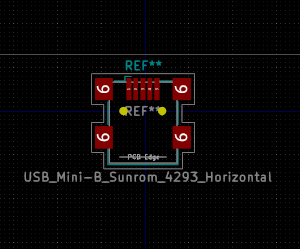
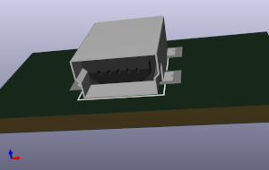
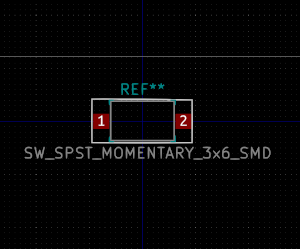

# KiCAD-footprints
Component footprints and 3D models that I've created for my projects.

## Sunrom 4293 Mini (B) USB Port - PCB SMD

[Sunrom 4293](https://www.sunrom.com/p/usb-mini-b-smd-connector)

Footprint | 3D Model
--------- | --------
 | 

## Switech SW-TS3545 SPST Momentary Switch - PCB SMD

[Switech SW-TS3545](https://switech.en.alibaba.com/product/60153274289-800801466/6x3mm_SMD_with_whiteactuator_tact_switch.html)

Footprint | 3D Model
--------- | --------
 | 

# License

Creative Commons Zero 1.0 - Use at will and enjoy!
